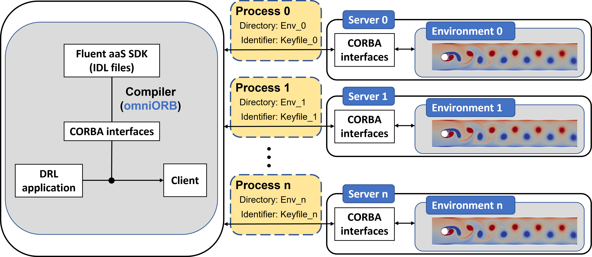

<div align="center">
<!-- Title: -->
  <h1>DRLFluent</h1>

DRLFluent is a distributed co-simulation framework coupling a DRL API, <a href="https://github.com/tensorforce/tensorforce">TensorForce</a> and a general CFD solver, <a href="https://www.ansys.com/products/fluids/ansys-fluent">Ansys-Fluent</a> . This framework is mainly for large-scale RL tasks where the environments are fluid flow simulated by CFD means.
</div>

## Dependencies
### Reinforcement learning
|      Package     |     Version   |
|:-----------------|--------------:|
| Python           |      3.7      |
| TensorFlow       |      1.13     |
| TensorForce      |      0.5.0    |

### CFD solver
|      Software    |     Version   |
|:-----------------|--------------:|
| Ansys-Fluent     |     ≥19.2     |

### Communication
|      Software    |     Version   |
|:-----------------|--------------:|
| omniORB          |     4.2.4     |
| omniORBpy        |     4.2.4     |


## Download

```bash
git clone https://github.com/YiqianMao0502/DRLFluent.git
```

## Installation

### OmniORB

OmniORB installaztion on local machines (Windows system) can be refered to <a href="https://www.youtube.com/watch?v=v4eZPioTOYs">Python-Fluent AAS coupling</a>. 

The omniORB v4.2.4 is included in the DRLFluent package. For other versions please download on <a href="https://sourceforge.net/projects/omniorb/files/">sourceforge.net</a>.

Copy the folder OmniORB to a long-term storage directory *Dir1*. Set environment variables by any of the following three ways.

1. Setting in .bashrc file. (recommended, set permanently on HPC)
2. Setting in the job script. (on HPC)
3. Setting mannually. (also applicable of installation on local machines)

The corresponding commands are listed below. Note that *Dir1* should be changed to the real directory of OmniORB.

```bash
export PYTHONPATH=$PYTHONPATH:Dir1/OmniORB/omni_inst/lib/python3.7/site-packages
export LD_LIBRARY_PATH=Dir1/OmniORB/omni_inst/lib
export PATH=$PATH:Dir1/OmniORB/omni_inst/bin
OMNINAMES_DATADIR=Dir1/OmniORB/wib/wob
export OMNINAMES_DATADIR
OMNIORB_CONFIG=Dir1/OmniORB/wib/wob/omniORB.cfg
export OMNIORB_CONFIG
```

Start omniNames

```bash
omniNames -start &
```

### Compile Corba interfaces (If using another version of OmniORB)

Collect CoFluentUnit.idl from the folder of Ansys-Fluent to the WorkingFolder *WDir1*. 

Compile CoFluentUnit.idl. Note that *WDir1* should be changed to the real directory of WorkingFolder.

```bash
omniidl -I Dir1/OmniORB/omni_inst/share/idl/omniORB -bpython WDir1/WorkingFolder/CoFluentUnit.idl
```

## Application development

The agent-environment interaction through the CORBA interfaces is shown in Fig. 1. The application development consists of three parts.

1. DRL. RL algorithm, network architecture, state, action, reward, etc.
2. CFD (Beige colour). Build a validated numerical model for simulating the environment.
3. Comminication (Coffee colour). 

<div align="center">


Fig. 1 Agent-environment interaction
</div>

The distributed architecture of DRLFluent is shown in Fig. 2, which allows clients and servers running on different devices are able to identify, locate and communicate with each other. The parallelization of learning is based on the multi-environment approach proposed by Rabault and Kuhnle, and the reader can also refer to the [open source
code](https://github.com/jerabaul29/Cylinder2DFlowControlDRLParallel).

<div align="center">



Fig. 2 Multi-environment learning by DRLFluent
</div>

## Workflow on HPC systems

As shown in Fig. 3, the workflow comprises three stages: For the first use, building the communication platform (orange lines), launching the fluent servers (blue lines), and running the DRL task (green lines).

<div align="center">


Fig. 3 Workflow of DRLFluent on HPC systems
</div>

The detailed workflow is given as below.

<div align="center">


</div>

## Example - Active control on flow around a circular cylinder at the Reynolds number of 100 

The example was realized on CSF3, a HPC cluster at the University of Manchester.

### Training

Copy WorkingFolder to the working directory. 

Change the number of sub jobs to the number of environments in the fluent-job-job-array.sge and submit the job array.

Change the number after -n to the number of environments in the Training_job file and submit Training_job.

### Inference
Submit Deterministic_job.

## Contact and Support
yiqian.mao@manchester.ac.uk (Yiqian Mao)